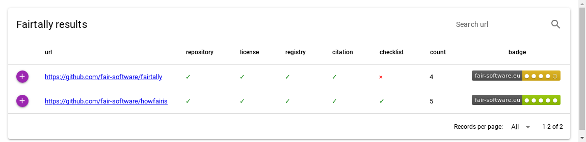

################################################################################
fairtally
################################################################################

Python application to analyze multiple GitHub and GitLab repositories compliance with the `fair-software.eu <fair-software.eu>`_ recommendations.

.. list-table::
   :widths: 25 25
   :header-rows: 1

   * - fair-software.nl recommendations
     - Badges
   * - \1. Code repository
     - |GitHub Badge|
   * - \2. License
     - |License Badge|
   * - \3. Community Registry
     - |PyPI Badge| |Research Software Directory Badge|
   * - \4. Enable Citation
     - |Zenodo Badge|
   * - \5. Checklist
     - |CII Best Practices Badge|
   * - **Other best practices**
     -
   * - Continuous integration
     - |Python Build| |PyPI Publish|

.. |GitHub Badge| image:: https://img.shields.io/badge/github-repo-000.svg?logo=github&labelColor=gray&color=blue
   :target: https://github.com/fair-software/fairtally
   :alt: GitHub Badge

.. |License Badge| image:: https://img.shields.io/github/license/fair-software/fairtally
   :target: https://github.com/fair-software/fairtally
   :alt: License Badge

.. |PyPI Badge| image:: https://img.shields.io/pypi/v/fairtally.svg?colorB=blue
   :target: https://pypi.python.org/project/fairtally/
   :alt: PyPI Badge
.. |Research Software Directory Badge| image:: https://img.shields.io/badge/rsd-fairtally-00a3e3.svg
   :target: https://www.research-software.nl/software/fairtally
   :alt: Research Software Directory Badge

..
    Goto https://zenodo.org/account/settings/github/ to enable Zenodo/GitHub integration.
    After creation of a GitHub release at https://github.com/fair-software/fairtally/releases
    there will be a Zenodo upload created at https://zenodo.org/deposit with a DOI, this DOI can be put in the Zenodo badge urls.
    In the README, we prefer to use the concept DOI over versioned DOI, see https://help.zenodo.org/#versioning.
.. |Zenodo Badge| image:: https://zenodo.org/badge/DOI/< replace with created DOI >.svg
   :target: https://doi.org/<replace with created DOI>
   :alt: Zenodo Badge

..
    A CII Best Practices project can be created at https://bestpractices.coreinfrastructure.org/en/projects/new
.. |CII Best Practices Badge| image:: https://bestpractices.coreinfrastructure.org/projects/< replace with created project identifier >/badge
   :target: https://bestpractices.coreinfrastructure.org/projects/< replace with created project identifier >
   :alt: CII Best Practices Badge

.. |Python Build| image:: https://github.com/fair-software/fairtally/workflows/Python/badge.svg
   :target: https://github.com/fair-software/fairtally/actions?query=workflow%3A%22Python%22
   :alt: Python Build

.. |PyPI Publish| image:: https://github.com/fair-software/fairtally/workflows/PyPI/badge.svg
   :target: https://github.com/fair-software/fairtally/actions?query=workflow%3A%22PyPI%22
   :alt: PyPI Publish

Installation
------------

To install fairtally, do:

.. code-block:: console

  pip3 install fairtally

Usage
-----

Apply fairtally to your favorite repositories like this:

.. code-block:: console

  fairtally --html tally.html https://github.com/fair-software/fairtally https://github.com/fair-software/howfairis

Then open the analysis in a web browser, for example Firefox:

.. code-block:: console

  firefox tally.html

The analysis will look something like this:

You can sort the table by clicking on the table headers. The purple plus signs on the left provide access to log messages of fairtally.

Research Software Directory
^^^^^^^^^^^^^^^^^^^^^^^^^^^

To FAIR tally the software listed on the `Research Software Directory of the Netherlands eScience Center <https://research-software.nl/>`_.

First download a list of software by calling `RSD API <https://github.com/research-software-directory/research-software-directory/blob/master/docs/documentation-for-developers.md#api>`_

.. code-block:: console

  curl https://research-software.nl/api/software > software.json

Next, extract the repository URLs with `jq <https://stedolan.github.io/jq/>`_.

.. code-block:: console

  cat software.json | jq -r '[.[].repositoryURLs.github] | flatten | .[]' > urls.txt

Finally run fairtally to generate a report.

.. code-block:: console

  fairtally --html report.html --input-file urls.txt

Documentation
*************

Command line interface help can be retrieved with

.. code-block:: console

  fairtally --help

Which then shows something like:

.. code-block:: console

  Usage: fairtally [OPTIONS] [URLS]...

  Options:
    --html FILENAME            Filename of where to write the results as HTML.
    --json FILENAME            Filename of where to write the results as JSON.
    -i, --input-file FILENAME  Check URLs in file. One URL per line. Use `-` to
                              read from standard input.

    --help                     Show this message and exit.

Contributing
************

If you want to contribute to the development of fairtally,
have a look at the `contribution guidelines <CONTRIBUTING.rst>`_.

License
*******

Copyright (c) 2021, Netherlands eScience Center

Licensed under the Apache License, Version 2.0 (the "License");
you may not use this file except in compliance with the License.
You may obtain a copy of the License at

http://www.apache.org/licenses/LICENSE-2.0

Unless required by applicable law or agreed to in writing, software
distributed under the License is distributed on an "AS IS" BASIS,
WITHOUT WARRANTIES OR CONDITIONS OF ANY KIND, either express or implied.
See the License for the specific language governing permissions and
limitations under the License.

Credits
*******

This package was created with `Cookiecutter <https://github.com/audreyr/cookiecutter>`_ and the `NLeSC/python-template <https://github.com/NLeSC/python-template>`_.

Instructions for developers
***************************

The project setup is documented in `a separate document <project_setup.rst>`_. Feel free to remove this document (and/or the link to this document) if you don't need it.

Run tests (including coverage) with:

.. code-block:: console

  python setup.py test
